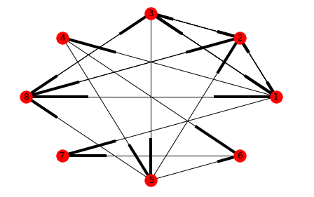
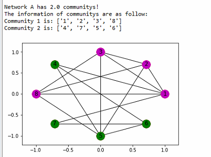
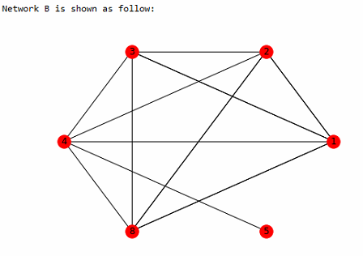
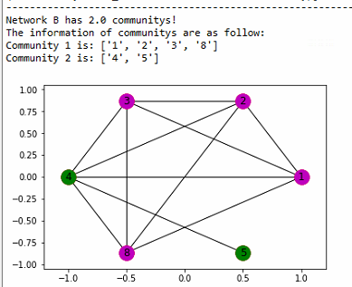

# 2. Louvain算法
- **算法原理&实验结果**

  之前主要的工作是对数据集（其中用户1,2,3,8是作弊团伙）分别构建了网络A和B，再利用 networkX 自带的 clique 算法发现网络中的社区，
  其中网络 A 只有一个 community[1,2,3,5,8]，网络B也只有一个 community[1,2,3,4,8]，最后通过求交集（覆盖率>80%），求得可疑用户组为 [1,2,3,8]。
  
  接着学习了另一个比较出名的社区发现算法：Louvain 算法，这个算法可以根据 edge 的权重进行社区构建，首先构建多重有向图 A，这个和之前方法一致：

  

  但需要注意的是，不论是 clique 算法，还是 Louvain 算法，都只能处理无向图，
  所以需要把A转换成无向图，其中A中edge权重设定为节点间的连边数，最后利用 Louvain 算法得出A中的 community：
  
  
  
  可以看出，利用 Louvain 算法构建网络A时就已经把作弊团伙精确识别出来了(Community 1)，接着构建网络B（如果两点间曾经共用过一个IP，那么则有一条edge）：
  
  
  
  网络B中权重设定如下：假设 A，B 两个用户，曾有IP1和IP2发送过数据，其中IP1的次数为x1,IP2的次数为x2，那么 AB 间的 edge 的权重为：
  
  
  
  其中 α 和 β 为参数，式子的意义在于权重不仅考虑 A，B 两个用户曾用过几个IP地址，而且将用过 IP 的次数也考虑进权重（实验中 α=2，β=0.5），
  最后利用Louvain算法得出B中的community：
  
  
  
  最后求网络A和B中community交集（覆盖率>80%）：
  
  

- **结论**

  从实验效果中看，Louvain 算法比 clique 渗透算法性能要好，划分准确度更高，重要的原因是 Louvain 算法考虑进了 edge 的权重，
  但是也有不足的地方，就是这些算法都没有考虑有向图的情况。
  但是经过反思，虽然使用算法之前，都将有向图转换为了无向图，但是影响不会很大，因为网络B是根据相同的发送IP进行构建的，虽然是无向图，
  但是这个发送IP的属性其实已经暗含了方向性，所以最后的结果也是不错的。
